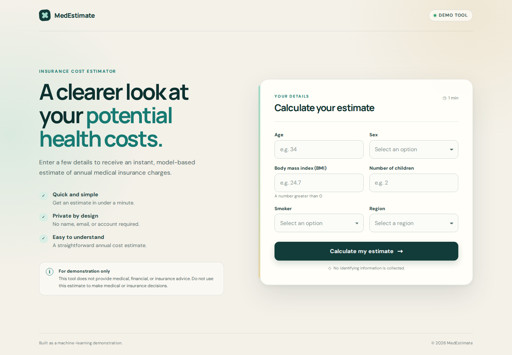

# Medical Insurance Cost Prediction


Train regression models locally and serve medical-insurance charge predictions through a React interface and a FastAPI JSON API.

Live demo:
<https://medical-insurance-cost.vercel.app>

Production backend URL:
<https://tumelokonaitedev--medical-insurance-cost-fastapi-app.modal.run>

Production API docs:
<https://tumelokonaitedev--medical-insurance-cost-fastapi-app.modal.run/docs>



## Architecture

The frontend and backend are independent applications with explicit, one-way dependencies:

```text
React + Vite frontend
    -> POST /predict-json
    -> FastAPI routes
    -> Pydantic request/response schemas
    -> PredictionService
    -> ArtifactRepository protocol
    -> LocalArtifactRepository (development) or PackagedMlflowRepository (production)

Successful prediction
    -> PredictionEventService (fail-open boundary)
    -> PredictionEventRepository
    -> PostgreSQL
```

- `frontend/` contains the React + Vite TypeScript application, browser validation,
  and typed API client.
- `src.api` contains application composition and lean HTTP routes.
- `src.schemas` owns the authoritative JSON validation contract.
- `src.services` owns inference orchestration.
- `src.repositories` is the only layer that reads or writes serialized model artifacts.
- `PredictionEventService` builds monitoring events independently of inference; its
  repository is the only layer that writes prediction data.
- `src.training` contains data ingestion, transformation, and model selection.

The application creates one prediction service per process. A single fitted scikit-learn pipeline containing preprocessing and regression is loaded lazily on the first prediction and cached for that service lifecycle. Modal startup validates and loads the baked MLflow package before returning the ASGI application, and the production repository reuses that process-cached model.

## Local setup

Requirements:

- Python 3.12+
- [uv](https://docs.astral.sh/uv/)
- Node.js 24+
- npm 10+

Install the application and development dependencies:

```bash
uv sync --extra dev
```

Alternatively, install the runtime requirements with pip:

```bash
python -m pip install -r requirements.txt
python -m pip install -e .
```

Install the frontend from its committed lockfile:

```bash
cd frontend
npm ci
```

Do not commit a frontend `.env` file. Values prefixed with `VITE_` are bundled
into browser code and must never contain secrets.

## Prediction event storage

Successful `/predict-json` predictions are stored as typed PostgreSQL rows.
These events provide the basis for measuring prediction
volume, input and output distributions, model-version usage, inference latency,
and future drift or accuracy once actual charges are available. Invalid requests
and failed inference attempts are not stored.

Persistence is deliberately fail-open. A database outage or rejected insert is
logged using only the generated request ID and exception type, and the successful
prediction is still returned. Database errors and credentials are never included
in an API response. `request_id` is unique, and inserts ignore conflicts so a
retry with the same ID cannot create another row. The application does not create
or alter tables during startup.

The `prediction_events` schema is:

| Column | Type | Notes |
| --- | --- | --- |
| `id` | UUID | Primary key |
| `request_id` | UUID | Unique and indexed |
| `created_at` | Timestamp with time zone | Indexed |
| `source` | String | `json` for the current API |
| `age` | Integer | Model feature |
| `sex` | String | Model feature |
| `bmi` | Numeric | Model feature |
| `children` | Integer | Model feature |
| `smoker` | String | Model feature |
| `region` | String | Model feature |
| `predicted_charges` | Numeric | Successful model output |
| `model_version` | String | Indexed; `local` locally or the packaged MLflow version |
| `prediction_contract_version` | String | Deployment contract version |
| `inference_latency_ms` | Numeric | Model call duration only |
| `actual_charges` | Nullable numeric | Reserved for a later accuracy workflow |
| `actual_recorded_at` | Nullable timestamp with time zone | When actual charges were supplied |

### Configure Neon and apply migrations

Create a Neon project and database, then copy the pooled connection string from
the Neon dashboard. Pooled hosts contain `-pooler` in the hostname. Put it in a
local `.env` file or the deployment platform's secret store—never in source
control:

```dotenv
DATABASE_URL=postgresql://<role>:<password>@<endpoint>-pooler.<region>.aws.neon.tech/<database>?sslmode=require
```

The application requires an encrypted psycopg SSL mode, upgrades missing or
unsafe modes to `sslmode=require`, preserves stricter verification modes, and
rejects a non-pooled Neon hostname. Load the environment and apply the checked-in
Alembic migrations from the repository root:

```bash
set -a
source .env
set +a
uv run alembic upgrade head
```

That command is the same for a development Neon branch and the deployed Neon
database; select the target solely through `DATABASE_URL`. Review the target and
backups before running a downgrade. To revert the initial schema intentionally:

```bash
uv run alembic downgrade base
```

After migration, start the API with the same `DATABASE_URL` environment variable.
If it is unset, inference remains available but event persistence is disabled.

### Privacy and intended use

Store only the six model features and monitoring metadata listed above. Do not
add names, email addresses, account identifiers, free-form request bodies, or
other personally identifying information. Restrict database access, rotate Neon
credentials, use separate roles and branches by environment, and define retention
rules before collecting any data beyond this demonstration.

This repository and its prediction-event data use synthetic/demo data only. The
application is not intended for real medical use, medical decisions, diagnosis,
insurance underwriting, or production availability, and it has no HIPAA or other
regulatory certification.

## Train and create local artifacts

Predictions require `artifacts/model.pkl`. This one artifact is the complete fitted pipeline and accepts the six raw request fields directly. Create it from the included dataset before using either prediction endpoint:

```bash
uv run python scripts/run_pipeline.py
```

The training pipeline creates its data splits and serialized artifacts under `artifacts/`, which is intentionally ignored by Git.

MLflow tracking is disabled by default, so the command above is entirely local and does not import or contact MLflow during training. To record the experiment in the local `mlruns/` file store instead:

```bash
ENABLE_MLFLOW_TRACKING=true \
MLFLOW_EXPERIMENT_NAME=medical-insurance-cost \
uv run python scripts/run_pipeline.py

MLFLOW_ALLOW_FILE_STORE=true uv run mlflow ui
```

Open <http://localhost:5000> to inspect candidate parameters and metrics, the selected-model metrics, raw-feature signature, input example, and logged pipeline. The file-store opt-in keeps this flow compatible with MLflow 3.15 and later. Set `MLFLOW_TRACKING_URI` to choose another backend; registration remains off unless explicitly enabled.

## DagsHub experiment tracking and model registry

The training code uses the same MLflow implementation for a local store and DagsHub; only environment and authentication settings differ. DagsHub runs are tagged with `tracking_backend=dagshub`. Registration occurs only after candidate evaluation, finite-metric validation, a raw-feature smoke prediction, and checks for the logged signature and input example. Only the selected pipeline is registered.

### Configure DagsHub

Every DagsHub repository has an MLflow endpoint at `https://dagshub.com/<owner>/<repository>.mlflow`. Find the exact value from the repository's **Remote** menu under **MLflow**, or append `.mlflow` to the repository URL. See the [DagsHub MLflow tracking guide](https://dagshub.com/docs/integration_guide/mlflow_tracking/) for the current UI.

Create an access token from [DagsHub user token settings](https://dagshub.com/user/settings/tokens). The account must have contributor access to the repository. Copy `.env.example` to `.env`, replace every placeholder locally, and load it into the shell before running a command:

```bash
cp .env.example .env
set -a
source .env
set +a
```

The expected settings are:

```dotenv
ENABLE_MLFLOW_TRACKING=true
ENABLE_MODEL_REGISTRATION=true
MLFLOW_TRACKING_URI=https://dagshub.com/<username>/<repository>.mlflow
MLFLOW_TRACKING_USERNAME=<dagshub-username>
MLFLOW_TRACKING_PASSWORD=<dagshub-access-token>
MLFLOW_EXPERIMENT_NAME=medical-insurance-cost
MLFLOW_REGISTERED_MODEL_NAME=medical-insurance-cost
```

`.env` is ignored by Git. Treat `MLFLOW_TRACKING_PASSWORD` as a secret: do not place it in the URI, shell history, logs, screenshots, commits, or issue text. The application uses MLflow's standard environment-variable authentication and deliberately fails instead of choosing the local store when credentials are present without a remote URI. Remote authentication and configuration errors are sanitized.

### Train and review a candidate

With the environment loaded, run:

```bash
uv run python scripts/run_pipeline.py
```

When both feature flags are true, the command logs one experiment and registers only the selected model as the next numeric version of `medical-insurance-cost`. It prints the run ID, source model URI, Git commit, dataset checksum, numeric version, and registered pipeline checksum. It does not assign `champion`.

Open the configured `.mlflow` URL in a browser. In the experiment run, compare candidate and selected metrics and inspect the parameters, Git and dataset lineage, signature, and input example. In **Models**, open `medical-insurance-cost` and its new version. New versions have `validation_status=candidate` plus these deployment-lineage tags:

- `training_run_id`
- `source_commit_sha`
- `dataset_sha256`
- `feature_schema_version`
- `prediction_contract_version`
- `selected_model`
- `selection_metric`
- `validation_status`
- `pipeline_sha256`

Inspect the same metadata from the terminal with an exact numeric version:

```bash
uv run python -m src.mlops inspect-model \
  --model-name medical-insurance-cost \
  --version 7 \
  --output json
```

### Promote, resolve, and verify

After the review succeeds, promotion is manual. In the DagsHub MLflow UI, set the version tag `validation_status=validated`, then assign or move the `champion` alias to that exact version. MLflow aliases are mutable by design; the [MLflow registry workflow](https://mlflow.org/docs/latest/ml/model-registry/workflow) describes their UI and API behavior.

The explicit CLI performs those two writes and requires the exact version plus confirmation:

```bash
uv run python -m src.mlops promote-model \
  --model-name medical-insurance-cost \
  --version 7 \
  --alias champion \
  --confirm \
  --output json
```

Resolve the human-facing alias before deployment:

```bash
uv run python -m src.mlops resolve-model \
  --model-name medical-insurance-cost \
  --alias champion \
  --output json
```

The resolver fails for a missing alias, nonnumeric version, incomplete lineage, malformed checksums, or any status other than `validated`. Its `model_uri` is always immutable, for example `models:/medical-insurance-cost/7`. Give that exact URI to deployment; never deploy `models:/medical-insurance-cost@champion` or `models:/medical-insurance-cost/latest`.

Before a deployment, verify that alias and numeric loading identify the same run and produce compatible finite predictions from the same raw input:

```bash
uv run python -m src.mlops verify-model \
  --model-name medical-insurance-cost \
  --alias champion \
  --output json
```

This check uses `mlflow.sklearn.load_model`, the flavor deployment must use for this pipeline.

### Rollback and token rotation

To roll back, review an earlier numeric version, confirm it already has complete lineage and is validated, then run `promote-model` with that earlier `--version`. This moves `champion`; resolve it again and pass the newly returned numeric URI to deployment. Existing deployments remain pinned until explicitly changed.

If a token is compromised, revoke it immediately in DagsHub user token settings, create a replacement, update `MLFLOW_TRACKING_PASSWORD` in local/CI secret storage, clear the old process environment, and rerun a read-only `inspect-model` or `resolve-model` command to confirm access. Do not alter the tracking URI or commit the replacement token.

Tracking settings:

- `ENABLE_MLFLOW_TRACKING` defaults to `false`.
- `MLFLOW_TRACKING_URI` is optional; enabled tracking defaults to the local `./mlruns` store.
- `MLFLOW_EXPERIMENT_NAME` defaults to `medical-insurance-cost`.
- `ENABLE_MODEL_REGISTRATION` defaults to `false` and requires tracking to be enabled.
- `MLFLOW_REGISTERED_MODEL_NAME` defaults to `medical-insurance-cost`.
- `MLFLOW_TRACKING_USERNAME` and `MLFLOW_TRACKING_PASSWORD` are required for a DagsHub URI.

## Immutable Modal deployment

DagsHub is a deployment-time dependency only. The packaging command resolves no aliases: it accepts exactly `models:/medical-insurance-cost/<positive-integer>`, validates registry and source-run lineage, downloads that version, verifies its serialized pipeline checksum, and creates `build/model/`. Modal then bakes that local package into the image. Container startup and predictions use only `/app/build/model`; no DagsHub credential is attached to the function.

Prediction persistence uses a separate Modal secret named
`medical-insurance-database`. After loading the Neon `DATABASE_URL` locally,
create or update it without placing its value in source:

```bash
uv run modal secret create medical-insurance-database DATABASE_URL="$DATABASE_URL"
```

Only this database secret is attached to the serving function. MLflow and DagsHub
credentials remain deployment-time-only and are never attached to inference.

The production image uses Python 3.12 and `requirements-serving.txt`. It includes the API, schemas, prediction service, local runtime validator, and packaged model. It excludes frontend assets, datasets, notebooks, training code, registry and promotion code, tests, credentials, caches, and local artifacts.

### Authenticate Modal

Install the locked deployment extra and authenticate the local Modal CLI:

```bash
uv sync --locked --extra deployment
uv run modal setup
```

For GitHub Actions, create Modal token credentials and store them as `MODAL_TOKEN_ID` and `MODAL_TOKEN_SECRET`. The protected `production` GitHub environment must contain these secrets plus:

- `MLFLOW_TRACKING_URI`
- `MLFLOW_TRACKING_USERNAME`
- `MLFLOW_TRACKING_PASSWORD`

The deployment workflow has only `contents: read` repository permission. MLflow credentials are scoped to the alias-resolution and packaging steps; the Modal deployment step receives only Modal credentials.

### Prepare and validate a package manually

Load the DagsHub settings described above, resolve `champion` once, and record every returned identity value:

```bash
uv run python -m src.mlops resolve-model \
  --model-name medical-insurance-cost \
  --alias champion \
  --output json
```

Use the returned numeric URI, run ID, and checksum without resolving the alias again:

```bash
uv run python -m src.mlops prepare-deployment \
  --model-uri models:/medical-insurance-cost/7 \
  --output-dir build/model \
  --expected-run-id "<run-id>" \
  --expected-pipeline-sha256 "<sha256>" \
  --output json
```

The output contains `build/model/model/` and `build/model/deployment_metadata.json`. The command refuses aliases, stages, `latest`, run URIs, filesystem paths, zero or negative versions, incomplete metadata, unexpected files in the output directory, checksum mismatches, invalid signatures or examples, unsupported flavors, and failed or non-finite smoke predictions.

Revalidate the completed package without registry credentials or network access:

```bash
env -u MLFLOW_TRACKING_URI \
    -u MLFLOW_TRACKING_USERNAME \
    -u MLFLOW_TRACKING_PASSWORD \
  uv run python -m src.mlops validate-deployment \
    --package-dir build/model \
    --output json
```

### Serve and deploy

Both commands require a completed `build/model` package:

```bash
uv run modal serve modal_app.py
uv run modal deploy modal_app.py
```

The CLI prints the generated web endpoint. It is also visible on the Modal dashboard under the `medical-insurance-cost` app. After a deployment to another workspace, update the two production URLs near the top of this README.

For production, open **Actions → Deploy immutable model to Modal → Run workflow**, leave the alias as `champion`, and dispatch it against the protected `production` environment. The workflow resolves the alias exactly once, pins the numeric URI as a step output, validates and packages that exact version, deploys it, and records the version, run ID, source commit, dataset checksum, pipeline checksum, and deployment ID in the workflow summary.

Verify the deployed application:

```bash
APP_URL="https://tumelokonaitedev--medical-insurance-cost-fastapi-app.modal.run"

curl "$APP_URL/health"
curl "$APP_URL/docs"
curl -X POST "$APP_URL/predict-json" \
  -H "Content-Type: application/json" \
  -d '{"age":29,"sex":"female","bmi":27.4,"children":2,"smoker":"no","region":"southeast"}'
```

`/health` must return `{"status":"ok"}`. The deployment workflow summary and startup log fields `deployment_id`, `model_name`, `model_version`, `mlflow_run_id`, `source_commit_sha`, and `pipeline_sha256` identify exactly what is running.

### Roll back

Every rollback passes the same lineage, signature, input-example, checksum, loading, and smoke-prediction gates as a forward deployment. Never use `latest`.

There are two supported approaches:

1. Redeploy a previously recorded exact numeric URI using its recorded run ID and pipeline checksum.
2. Move `champion` to a previously validated numeric version with `promote-model`, dispatch the workflow, and let that new run resolve the alias once before packaging the returned numeric URI.

Moving `champion` after a workflow has resolved it cannot change that active deployment because every later step uses the recorded numeric URI.

## Run the API

```bash
uv run uvicorn src.main:app --reload --port 8000
```

Open the interactive API documentation at <http://localhost:8000/docs>. FastAPI
is API-only; the user interface is served by Vite during development.

Health check:

```bash
curl http://localhost:8000/health
```

JSON prediction:

```bash
curl -X POST http://localhost:8000/predict-json \
  -H "Content-Type: application/json" \
  -d '{"age":29,"sex":"female","bmi":27.4,"children":2,"smoker":"no","region":"southeast"}'
```

Successful JSON responses use this schema:

```json
{
  "predicted_charges": 12345.67,
  "currency": "USD"
}
```

Valid categorical values are:

- `sex`: `female`, `male`
- `smoker`: `yes`, `no`
- `region`: `northeast`, `northwest`, `southeast`, `southwest`

## Run the frontend

Start the backend as shown above, then use a second terminal:

```bash
cd frontend
npm ci
npm run dev
```

Open <http://localhost:5173>. In development, the frontend always sends a
relative request to `/predict-json`; Vite proxies that route to
`http://localhost:8000`, so local CORS workarounds and hard-coded URLs are not
needed.

Production is deployed by the Vercel project `medical-insurance-cost`, connected
to this GitHub repository with these settings:

| Setting | Value |
| --- | --- |
| Root Directory | `frontend` |
| Framework Preset | Vite |
| Install Command | `npm ci` |
| Build Command | `npm run build` |
| Output Directory | `dist` |
| Node.js Version | `24.x` |

The Production and Preview environments define this public build-time variable:

```dotenv
VITE_API_BASE_URL=https://tumelokonaitedev--medical-insurance-cost-fastapi-app.modal.run
```

`VITE_*` values are embedded in browser JavaScript during `npm run build`. They
are public configuration and must never contain tokens, passwords, or other
secrets. Redeploy after changing `VITE_API_BASE_URL`; an existing build does not
pick up later environment changes. The frontend removes trailing slashes and
appends `/predict-json`. Production builds show a controlled configuration error
if this value is missing, malformed, contains credentials, or does not use
HTTP(S). The HTTPS Vercel frontend uses the HTTPS FastAPI endpoint to avoid
mixed-content blocking.

### Backend CORS allowlist

FastAPI reads a comma-separated list of exact origins. Local and production
origins can be enabled independently:

```dotenv
CORS_ALLOWED_ORIGINS=http://localhost:5173,https://medical-insurance-cost.vercel.app
```

Wildcard origins and origins containing credentials, paths, query strings, or
fragments are rejected. `modal_app.py` injects this value into the serving
function, and changing the allowlist requires redeploying Modal. Generated Vercel
preview URLs are intentionally not covered, so Preview builds render but their
prediction requests are blocked by CORS. Enable a live Preview prediction only
by allowlisting that trusted Preview origin exactly and redeploying Modal; do not
use a wildcard or a generated-domain pattern.

The production architecture is the Vercel-hosted `frontend/` calling the
separately deployed FastAPI backend. Vercel project IDs, account metadata,
`.vercel/`, local environment files, tokens, and credentials are not committed.

## Docker

Train the artifacts locally first, then build and run the image:

```bash
docker build -t insurance-cost-api .
docker run --rm -p 8000:8000 insurance-cost-api
```

Or use Compose:

```bash
docker compose up --build
```

## Development

Backend checks:

```bash
uv run --extra dev pytest
uv run --extra dev ruff check .
```

Frontend checks:

```bash
cd frontend
npm run lint
npm test
npm run build
```

Equivalent Make targets are available:

```bash
make pipeline
make run
make test
make lint
```

## Project structure

```text
frontend/
├── src/
│   ├── components/
│   ├── services/
│   ├── types/
│   └── utils/
├── package.json
├── package-lock.json
└── vite.config.ts

src/
├── api/
│   ├── dependencies.py
│   └── routes/
├── mlops/
│   ├── config.py
│   ├── registry.py
│   └── tracking.py
├── repositories/
├── schemas/
├── services/
├── training/
├── exceptions.py
└── main.py
```

- Dataset: `Data/medical_insurance.csv`
- Model card: `docs/MODEL_CARD.md`
- License: `LICENSE`
