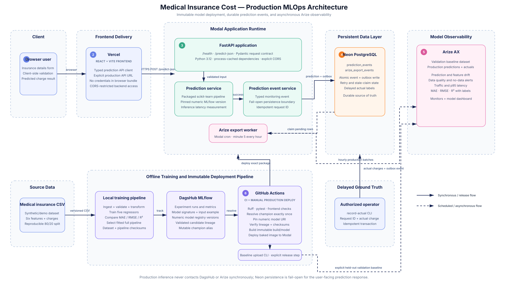

# Medical Insurance Cost Prediction

[](https://github.com/TumeloKonaite/Medical-Insurance-Cost/actions/workflows/ci.yml)


An end-to-end regression product that predicts medical insurance charges and
demonstrates production-minded ML engineering: experiment tracking, model
registry governance, immutable deployment, durable prediction events, and
asynchronous model monitoring.

[Live demo](https://medical-insurance-cost.vercel.app) ·
[Architecture](docs/architecture.svg) ·
[Model card](docs/MODEL_CARD.md)

> The Modal API scales to zero, so the first prediction after an idle period may
> take a few seconds while the container starts.


## What this project demonstrates

- **Full-stack product delivery:** a responsive React + TypeScript interface on
  Vercel backed by a validated FastAPI prediction contract on Modal.
- **Reproducible model development:** deterministic data splitting, five
  candidate regressors, held-out evaluation, and a single deployable scikit-learn
  preprocessing-and-model pipeline.
- **Model governance:** DagsHub MLflow tracks parameters, metrics, signatures,
  examples, source commits, dataset hashes, and immutable numeric model versions.
- **Safe deployment:** GitHub Actions resolves the reviewed `champion` alias once,
  verifies lineage and checksums, packages the exact version, and deploys it to
  Modal without exposing registry credentials at runtime.
- **Reliable observability:** Neon stores prediction events and an export outbox
  atomically; an hourly Modal worker sends versioned batches to Arize AX without
  adding Arize latency or availability risk to the prediction endpoint.
- **Defensive engineering:** strict input and URL validation, fail-open event
  persistence, idempotent writes, bounded export retries, secret isolation, and
  automated backend and frontend quality gates.

## Architecture

[](docs/architecture.svg)

The production system separates the online request path from training, registry,
deployment, and monitoring concerns:

1. The browser sends six validated features from the Vercel application to
   `POST /predict-json`.
2. FastAPI runs a process-cached, immutable scikit-learn pipeline packaged from an
   exact numeric MLflow model version.
3. A successful prediction and its pending outbox record are committed together
   in Neon PostgreSQL. Database persistence is fail-open for the user response.
4. A scheduled Modal worker claims pending records and uploads sanitized,
   version-specific prediction or actual batches to Arize AX.
5. The offline path trains and evaluates candidates, records lineage in DagsHub,
   and deploys a reviewed version through a protected GitHub Actions workflow.

## Technology stack

| Area | Technology | Purpose |
| --- | --- | --- |
| Frontend | React, TypeScript, Vite, Vitest | Typed UI, browser validation, and API integration |
| API | FastAPI, Pydantic, Uvicorn | Request validation and prediction serving |
| Machine learning | pandas, scikit-learn | Preprocessing, model comparison, and regression |
| Experiment tracking | MLflow on DagsHub | Metrics, artifacts, lineage, and model registry |
| Database | Neon PostgreSQL, SQLAlchemy, Alembic | Durable prediction events and transactional outbox |
| Deployment | Modal, Vercel | Serverless API/worker and frontend hosting |
| Monitoring | Arize AX | Drift, data quality, traffic, latency, and performance |
| Automation | GitHub Actions, pytest, Ruff, ESLint | CI checks and immutable production deployment |

## Key engineering decisions

| Concern | Decision |
| --- | --- |
| Training/serving skew | Package preprocessing and regression as one fitted pipeline |
| Mutable registry aliases | Resolve `champion` once, then deploy only the exact numeric URI |
| Artifact integrity | Verify model signature, input example, lineage, and SHA-256 checksum |
| Inference availability | Never call DagsHub or Arize during a prediction request |
| Monitoring reliability | Commit the prediction and outbox row in one database transaction |
| Duplicate delivery | Reuse `request_id` as the stable Arize prediction ID |
| Export failures | Recover stale claims and retry with bounded exponential backoff |
| Credential exposure | Use separate Modal secrets and narrow credentials to each workflow step |

## Prediction API

Send a request to the deployed endpoint:

```bash
curl -X POST \
  https://tumelokonaitedev--medical-insurance-cost-fastapi-app.modal.run/predict-json \
  -H "Content-Type: application/json" \
  -d '{
    "age": 29,
    "sex": "female",
    "bmi": 27.4,
    "children": 2,
    "smoker": "no",
    "region": "southeast"
  }'
```

Response:

```json
{
  "predicted_charges": 12345.67,
  "currency": "USD"
}
```

## Quick start

Prerequisites: Python 3.12+, [uv](https://docs.astral.sh/uv/), Node.js 24+,
and npm 10+.

Install dependencies and train the local model:

```bash
uv sync --locked --extra dev --extra monitoring
uv run python scripts/run_pipeline.py

cd frontend
npm ci
cd ..
```

Start the API:

```bash
uv run uvicorn src.main:app --reload --port 8000
```

Start the frontend in a second terminal:

```bash
cd frontend
npm run dev
```

Open <http://localhost:5173>. Vite proxies prediction requests to the local API
at <http://localhost:8000>.

For environment configuration, Neon setup, Docker, and production frontend
settings, see the [local development guide](docs/local-development.md).

## Testing and quality gates

Backend:

```bash
uv run --extra dev --extra monitoring ruff check .
uv run --extra dev --extra monitoring pytest
```

Frontend:

```bash
cd frontend
npm run lint
npm test
npm run build
```

GitHub Actions runs these checks for pushes and pull requests. Production model
deployment is a separate manually dispatched workflow protected by the GitHub
`production` environment.

## Repository map

```text
frontend/                 React + TypeScript application
src/
├── api/                  FastAPI routes and dependency composition
├── schemas/              Authoritative request and event contracts
├── services/             Inference and event orchestration
├── repositories/         Model artifact and prediction persistence adapters
├── training/             Ingestion, transformation, and model selection
├── mlops/                MLflow tracking, registry, packaging, and validation
└── monitoring/           Arize client, outbox exporter, baseline, and actuals
migrations/               Alembic prediction-event and outbox migrations
scripts/                  Local training entry point
tests/                    Backend unit and integration tests
.github/workflows/        CI and immutable Modal deployment
```

## Documentation

| Guide | Contents |
| --- | --- |
| [Local development](docs/local-development.md) | Setup, training, API, frontend, Neon, Docker, and tests |
| [MLflow and deployment](docs/mlops-deployment.md) | DagsHub, registry review, promotion, packaging, GitHub Actions, Modal, and rollback |
| [Arize monitoring](docs/arize-monitoring.md) | Transactional outbox, baseline, exporter, delayed labels, monitors, and operations |
| [Model card](docs/MODEL_CARD.md) | Intended use, features, limitations, fairness, and improvement areas |
| [MVP demo notes](docs/issue-mvp-demo.md) | Original demonstration scope and verification notes |

## Responsible use

This project uses synthetic/demo data and is intended for education and portfolio
demonstration only. It is not designed for medical decisions, diagnosis,
insurance underwriting, pricing, eligibility decisions, or production use with
personal data. It has no HIPAA or other regulatory certification.

The model uses demographic and health-related attributes, including sex, BMI,
and smoking status. No formal fairness analysis has been completed, and the
model may reproduce bias present in the dataset. See the
[model card](docs/MODEL_CARD.md) for limitations and improvement opportunities.

## License

Distributed under the terms in [LICENSE](LICENSE).
